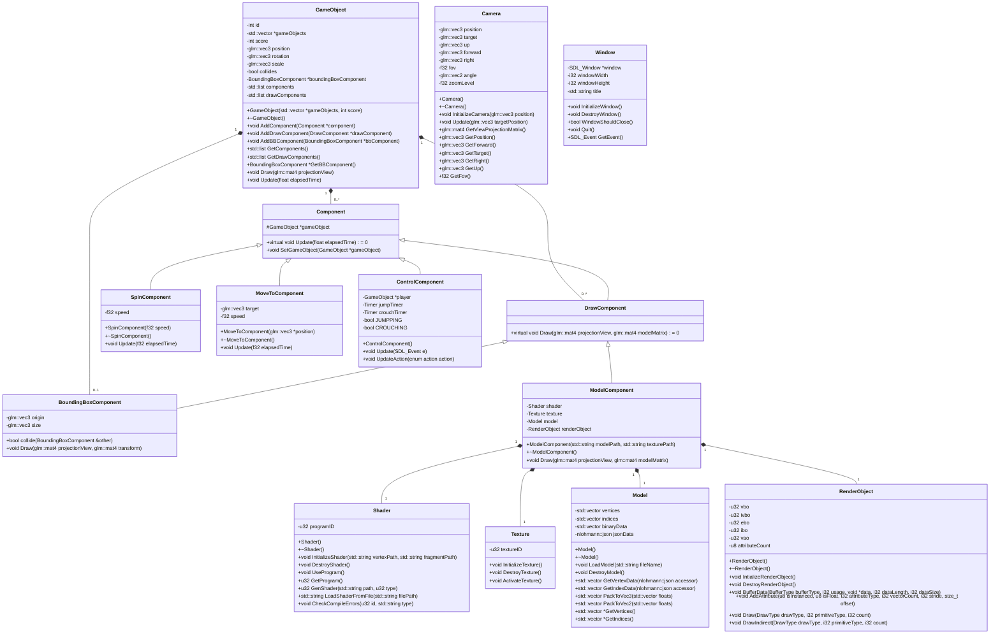

```mermaid
classDiagram
    class GameObject {
        -int id
        -std::vector<GameObject *> *gameObjects
        -int score
        -glm::vec3 position
        -glm::vec3 rotation
        -glm::vec3 scale
        -bool collides
        -BoundingBoxComponent *boundingBoxComponent
        -std::list<Component *> components
        -std::list<DrawComponent *> drawComponents
        +GameObject(std::vector<GameObject *> *gameObjects, int score)
        +~GameObject()
        +void AddComponent(Component *component)
        +void AddDrawComponent(DrawComponent *drawComponent)
        +void AddBBComponent(BoundingBoxComponent *bbComponent)
        +std::list<Component *> GetComponents()
        +std::list<DrawComponent *> GetDrawComponents()
        +BoundingBoxComponent *GetBBComponent()
        +void Draw(glm::mat4 projectionView)
        +void Update(float elapsedTime)
    }

    class Component {
        #GameObject *gameObject
        +virtual void Update(float elapsedTime) = 0
        +void SetGameObject(GameObject *gameObject)
    }

    class DrawComponent {
        +virtual void Draw(glm::mat4 projectionView, glm::mat4 modelMatrix) = 0
    }

    class BoundingBoxComponent {
        -glm::vec3 origin
        -glm::vec3 size
        +bool collide(BoundingBoxComponent &other)
        +void Draw(glm::mat4 projectionView, glm::mat4 transform)
    }

    class Shader {
        -u32 programID
        +Shader()
        +~Shader()
        +void InitializeShader(std::string vertexPath, std::string fragmentPath)
        +void DestroyShader()
        +void UseProgram()
        +u32 GetProgram()
        +u32 GenShader(std::string path, u32 type)
        +std::string LoadShaderFromFile(std::string filePath)
        +void CheckCompileErrors(u32 id, std::string type)
    }

    class RenderObject {
        -u32 vbo
        -u32 ivbo
        -u32 ebo
        -u32 ibo
        -u32 vao
        -u8 attributeCount
        +RenderObject()
        +~RenderObject()
        +void IntializeRenderObject()
        +void DestroyRenderObject()
        +void BufferData(BufferType bufferType, i32 usage, void *data, i32 dataLength, i32 dataSize)
        +void AddAttribute(u8 isInstanced, u8 isFloat, i32 attributeType, i32 vectorCount, i32 stride, size_t offset)
        +void Draw(DrawType drawType, i32 primitiveType, i32 count)
        +void DrawIndirect(DrawType drawType, i32 primitiveType, i32 count)
    }

    class Model {
        -std::vector<f32> vertices
        -std::vector<u32> indices
        -std::vector<u8> binaryData
        -nlohmann::json jsonData
        +Model()
        +~Model()
        +void LoadModel(std::string fileName)
        +void DestroyModel()
        +std::vector<f32> GetVertexData(nlohmann::json accessor)
        +std::vector<u32> GetIndexData(nlohmann::json accessor)
        +std::vector<glm::vec3> PackToVec3(std::vector<f32> floats)
        +std::vector<glm::vec2> PackToVec2(std::vector<f32> floats)
        +std::vector<f32> *GetVertices()
        +std::vector<u32> *GetIndices()
    }

    class ModelComponent {
        -Shader shader
        -Texture texture
        -Model model
        -RenderObject renderObject
        +ModelComponent(std::string modelPath, std::string texturePath)
        +~ModelComponent()
        +void Draw(glm::mat4 projectionView, glm::mat4 modelMatrix)
    }

    class SpinComponent {
        -f32 speed
        +SpinComponent(f32 speed)
        +~SpinComponent()
        +void Update(f32 elapsedTime)
    }

    class MoveToComponent {
        -glm::vec3 target
        -f32 speed
        +MoveToComponent(glm::vec3 *position)
        +~MoveToComponent()
        +void Update(f32 elapsedTime)
    }

    class ControlComponent {
        -GameObject *player
        -Timer jumpTimer
        -Timer crouchTimer
        -bool JUMPPING
        -bool CROUCHING
        +ControlComponent()
        +void Update(SDL_Event e)
        +void UpdateAction(enum action action)
    }

    class Camera {
        -glm::vec3 position
        -glm::vec3 target
        -glm::vec3 up
        -glm::vec3 forward
        -glm::vec3 right
        -f32 fov
        -glm::vec2 angle
        -f32 zoomLevel
        +Camera()
        +~Camera()
        +void InitializeCamera(glm::vec3 position)
        +void Update(glm::vec3 targetPosition)
        +glm::mat4 GetViewProjectionMatrix()
        +glm::vec3 GetPosition()
        +glm::vec3 GetForward()
        +glm::vec3 GetTarget()
        +glm::vec3 GetRight()
        +glm::vec3 GetUp()
        +f32 GetFov()
    }

    class Window {
        -SDL_Window *window
        -i32 windowWidth
        -i32 windowHeight
        -std::string title
        +void InitializeWindow()
        +void DestroyWindow()
        +bool WindowShouldClose()
        +void Quit()
        +SDL_Event GetEvent()
    }

    class Texture {
        -u32 textureID
        +void InitializeTexture()
        +void DestroyTexture()
        +void ActivateTexture()
    }

    GameObject "1" *-- "0..*" Component
    GameObject "1" *-- "0..*" DrawComponent
    GameObject "1" *-- "0..1" BoundingBoxComponent

    Component <|-- DrawComponent
    DrawComponent <|-- BoundingBoxComponent
    DrawComponent <|-- ModelComponent
    Component <|-- SpinComponent
    Component <|-- MoveToComponent
    Component <|-- ControlComponent

    ModelComponent "1" *-- "1" Shader
    ModelComponent "1" *-- "1" Texture
    ModelComponent "1" *-- "1" Model
    ModelComponent "1" *-- "1" RenderObject
```
