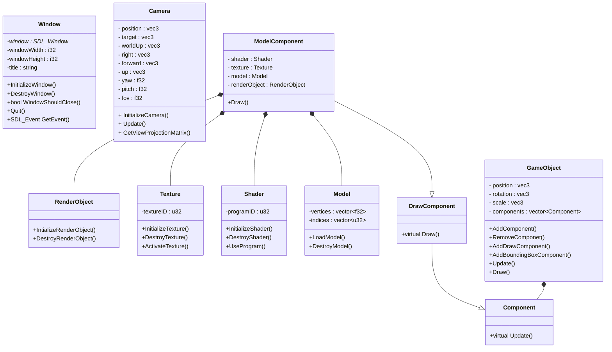

```mermaid
classDiagram 
    class Window{
        -window : SDL_Window* 
        -windowWidth : i32
        -windowHeight : i32
        -title : string
        +InitializeWindow()
        +DestroyWindow()
        +bool WindowShouldClose()
        +Quit() 
        +SDL_Event GetEvent()
    }
    class RenderObject{
        +IntializeRenderObject()
        +DestroyRenderObject()
    }
    class Texture{
        -textureID : u32
        +InitializeTexture()
        +DestroyTexture()
        +ActivateTexture()
    }
    class Shader{
        -programID : u32
        +InitializeShader()
        +DestroyShader()
        +UseProgram()
    }
    class Model{
        -vertices : vector~f32~
        -indices : vector~u32~
        +LoadModel()
        +DestroyModel()
    }
    class Camera{
        - position : vec3
        - target : vec3
        - worldUp : vec3
        - right : vec3
        - forward : vec3
        - up : vec3
        - yaw : f32
        - pitch : f32
        - fov : f32
        + InitializeCamera()
        + Update()
        + GetViewProjectionMatrix()
    }

    class Component{
        +virtual Update()
    }

    class DrawComponent{
        +virtual Draw()
    }

    class ModelComponent{
        - shader : Shader
        - texture : Texture
        - model : Model
        - renderObject : RenderObject
        +Draw()
    }

    class GameObject{
        - position : vec3
        - rotation : vec3
        - scale : vec3
        - components : vector~Component~

        +AddComponent()
        +RemoveComponet()
        +AddDrawComponent()
        +AddBoundingBoxComponent()
        +Update()
        +Draw()
    }

    DrawComponent --|> Component
    ModelComponent --|> DrawComponent
    ModelComponent *-- RenderObject
    ModelComponent *-- Shader
    ModelComponent *-- Texture
    ModelComponent *-- Model
    GameObject *-- Component
```